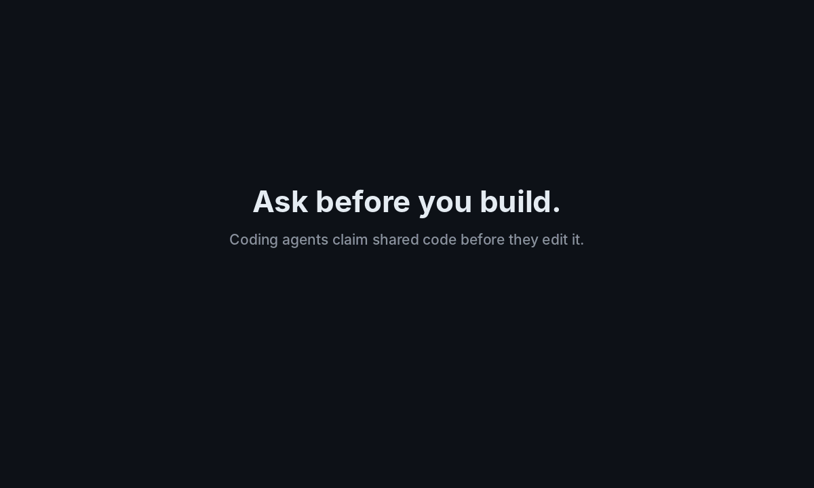

# Claim Before Code

**No agent writes code until its claim is accepted.**

A small claims registry for teams whose coding agents keep building in each other's areas.
The command is `cbc`.

Companion to the article [When Your Team's Coding Agents Start Stepping on Each Other](https://vinayroy.substack.com/p/when-your-teams-coding-agents-start).
It is a reference implementation of the workflow in that article, kept small enough to read in one sitting.



<sub>A replay of <code>demo.sh</code>. The command output is from a real run; regenerate it with <code>docs/make_demo_gif.py</code> (needs Pillow).</sub>

---

## The problem it solves

Agents work fast, each in its own worktree, and when something they need doesn't exist yet, they build it.
So two agents on two different tickets end up changing the same shared pricing code or the same model,
and nobody finds out until review, when one version has to be thrown away.

Worktrees keep agents from overwriting each other's files, but they don't stop two agents from building the same thing.
GitHub's CODEOWNERS knows who owns what, but it only checks when a pull request is opened, which is too late.
Claims moves that check to the moment an agent decides what it is about to touch.

## How it works

```
  agent proposes what it will touch
                │
                ▼
     ┌─────────────────────┐
     │   claims registry   │   one SQLite file, shared by every
     │  (atomic check)     │   worktree of the clone
     └─────────────────────┘
        │        │        │
   no overlap  overlap   someone else's code (CODEOWNERS)
        │        │        or a whole hot file
        ▼        ▼        ▼
    ACCEPTED   PENDING ──► request to the owner ──► grant / decline with a note
   (with a      │                    │
    lease)      │          no answer in time ──► escalates to the coordinator
                ▼
        agent waits, doesn't build a workaround

  While it works: a PreToolUse hook blocks edits no accepted claim covers.
  At review:      a pull request check fails changes outside the claim.
```

The rules:

- **Claim before you edit.** A claim is a set of targets: a folder (`src/promotions/`), a file, or, in a hot file, a single function (`src/pricing/calculate.py::calculate_total`).
- **Overlaps go to people, not to merge.** If another ticket already holds an overlapping claim, the request goes to that ticket's owner. If CODEOWNERS gives the code to someone else, the request goes to them.
- **Busy files are claimed by function.** Two agents can work in `calculate.py` at once. Only one can change `calculate_total`. Changes outside every function need a whole-file claim, which goes to the coordinator.
- **Nothing blocks forever.** Claims carry a lease that expires unless renewed, and requests nobody answers escalate to the coordinator.
- **Check what actually changed.** Plans are predictions. The hook and the pull request check compare real edits with the claim.

## What it looks like

This is `./demo.sh`, the scenario from the article:

```
== 10:02  Dana's checkout agent claims calculate_total
#1 ACCEPTED: Accepted. You may edit these targets.

== 10:15  Lee's promotions agent claims apply_discount in the same file, plus its own folder
#2 ACCEPTED: Accepted. You may edit these targets.

== Lee's agent edits apply_discount: inside its claim
hook: edit allowed

== 10:28  Lee's agent finds it also needs calculate_total and tries to edit it directly
No accepted claim for src/pricing/calculate.py::calculate_total on PRM-207. Run: cbc propose src/pricing/calculate.py::calculate_total and wait for acceptance.
hook: edit blocked (exit 2)

== So it asks instead
#3 PENDING: Paused. Do not edit these targets yet. src/pricing/calculate.py::calculate_total is already claimed by CHK-412 (accepted). Request sent to @dana.

== Dana's inbox
request #1  PRM-207 (@lee): src/pricing/calculate.py::calculate_total is already claimed by CHK-412 (accepted).
    why: store applied promo codes on the total
    answer: cbc grant 1  |  cbc decline 1 --note "..."

== Dana declines and says what to do instead
Request #1 declined. Claim #3 is now declined.
```

Lee's agent now sees Dana's note ("I'll add a promo_codes argument to calculate_total by 3pm. Build against that.") instead of inventing a second version.

## Set it up

Requirements: Python 3.11 or newer and git. No other dependencies.

1. Copy this `claim-before-code/` folder into the root of your repo.
2. Copy `cbc.example.toml` to `.cbc.toml` and set your coordinator and hot files.
3. Tell everyone who they are, once per machine: `git config cbc.handle @your-handle`.
4. Add the hook from `settings.example.json` to `.claude/settings.json`.
5. Copy `claude/commands/start.md` to `.claude/commands/start.md`. Developers now start a ticket with `/start PRM-207`.
6. Add the rule from `CLAUDE.snippet.md` to your `CLAUDE.md` or `AGENTS.md`.
7. Optional: add `cbc-check.example.yml` as a GitHub Actions workflow, and `mcp.example.json` to `.mcp.json` so Codex, Cursor, or any other MCP client can use the same registry.

Start lighter if you like. The article suggests the standing instruction alone at first, then the start command, the hook, and the pull request check once the habit sticks.

## Commands

| Command | What it does |
|---------|--------------|
| `cbc propose <targets...> [--reason]` | Claim targets for the current ticket. Exits 0 when accepted, 3 when pending |
| `cbc status [--all]` | This ticket's claims and requests, or every active claim |
| `cbc inbox` | Requests waiting on you (or escalated to you, if you're the coordinator) |
| `cbc grant <id>` / `cbc decline <id> --note "..."` | Answer a request |
| `cbc renew` | Extend the lease on this ticket's claims |
| `cbc release` | Release this ticket's claims after merge |
| `cbc export -o .claims/<TICKET>.json` | Write the claim manifest the pull request check reads |
| `cbc check-diff [--base origin/main] [--manifest file]` | Fail if the branch changed code outside its claim |
| `cbc feed` | Recent activity: accepted, pending, declined, escalated, expired |
| `cbc hook` | The Claude Code PreToolUse hook (reads the hook JSON on stdin) |
| `cbc mcp` | A stdio MCP server exposing propose, status, check, renew, release, and inbox |

The ticket comes from `--ticket`, the `CBC_TICKET` variable, or the branch name (`feat/PRM-207-promo-codes`).
Your handle comes from `--as`, `CBC_HANDLE`, or `git config cbc.handle`.

## Design choices

**Why SQLite in the git directory?** Every worktree of a clone shares one `.git` directory, so one database there is visible to every agent on that machine with no server to run. Each proposal is checked inside a `BEGIN IMMEDIATE` transaction, so two agents claiming the same code at the same moment can't both win. The test suite races eight processes for one function and checks that exactly one is accepted.

**Why function-level claims only in hot files?** File claims are simple, and every tool already speaks in file paths. But they turn the busiest files into queues. Function claims fix that at the cost of parsing, so they're limited to the short list of files where it pays off. Python is parsed exactly with `ast`. JavaScript and TypeScript use a best-effort scan for top-level functions, arrow functions, and classes. Other languages fall back to whole-file claims.

**Why route to people?** Ownership is a decision about people's work. The registry handles the routine case automatically and only asks a person when there's an actual overlap.

## Limits

- **One machine per registry by default.** Agents on different laptops need a shared database path (`CBC_DB` on a shared drive) or a small server in front of the registry. That server is deliberately left out to keep this readable.
- **The hook is best-effort.** An agent can still change files through the shell. The pull request check is the backstop.
- **The manifest is self-reported.** In CI, the check trusts `.claims/<TICKET>.json` from the branch. A team that needs a stronger guarantee should have CI read the registry itself.
- **Signatures ripple.** A function claim doesn't cover that function's callers. For widely used functions, treat the signature as a contract owned by one ticket.

## Related work

- [Shepherd](https://github.com/Korso-AI/Shepherd) by Korso is a hosted and self-hostable hub that gives agents leases on parts of a codebase and a live view of what each agent is doing. It solves the visibility problem well. Claims takes a narrower, local-first approach focused on ownership: CODEOWNERS routing, function-level claims, and human approval for conflicts.
- [GitHub CODEOWNERS](https://docs.github.com/articles/about-codeowners) provides the ownership map this tool reads.
- [Claude Code hooks](https://code.claude.com/docs/en/hooks) are how the edit check runs.

## Tests

```
cd claim-before-code
python3 -m unittest discover -s tests
./demo.sh
```

## License

MIT. See [LICENSE](../LICENSE).
